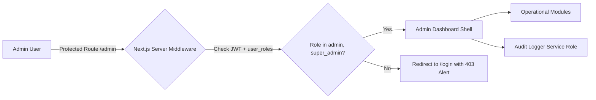
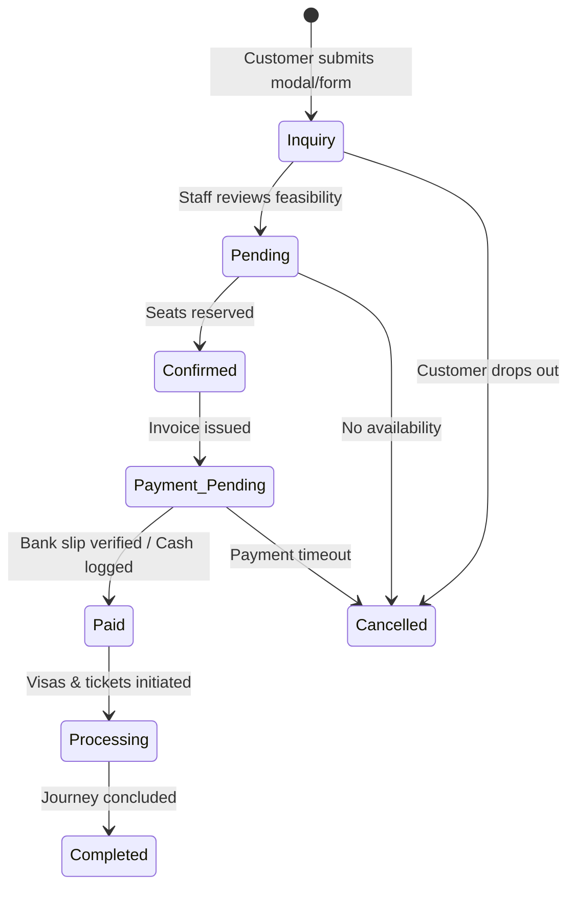

# Shoccho International Travels: Admin Back-Office Architecture

This document specifies the operational architecture, screen layouts, workflows, and administrative consoles for Shoccho International Travels staff, managers, and executives.

---

## 1. Back-Office Layout & Access Model

The administration back-office is segregated from public routes under `/admin` and guarded by Next.js Server Middleware checking the `is_admin()` / `is_super_admin()` role claims.

```
/admin
├── dashboard/               # Executive KPIs, active departures, urgent tasks
├── packages/                # Package inventory, departures, and pricing
├── bookings/                # Booking lifecycle pipeline, manifests, offline payments
├── customers/               # Customer CRM, passport vault review, VIP tiers
├── inquiries/               # Contact leads, WhatsApp/Call routing, assignment
├── muallims/                # Verification queue, scholar profiles, consultation audits
├── services/                # Visa requirements engine, flight routes, hotel contracts
├── community/               # Review approvals, story moderation, user reports
├── media/                   # Asset storage, banners, travel gallery
└── settings/                # System audit logs, user roles, notification templates
```



---

## 2. Core Administrative Modules

### 2.1 Executive Dashboard & Operational KPIs
- **Live Metrics**:
  - Total Active Bookings (by status).
  - Upcoming Departures within next 14 days.
  - Pending Visa Applications awaiting embassy submission.
  - Unresolved Customer Inquiries (SLA timer).
  - Pending Muallim Verification Applications.
  - Monthly Gross Booking Volume (BDT).
- **Urgent Action Center**: Direct shortcuts to bookings requiring seat allocation, visa submissions approaching flight dates, and reported community content.

### 2.2 Package & Inventory Management Console
- **Package Editor**:
  - Multi-tab form: Basic Info, Pricing & Durations, Hotel Details (Makkah/Madinah distances), Inclusions/Exclusions, Media Gallery.
  - Real-time Bengali and English preview matching Stitch design cards.
- **Departure Batch Scheduler**:
  - Create and manage departure batches (e.g. `15 Ramadan 2026 Departure`).
  - Configure capacity limits, available seats, quad/triple/double pricing variations, and assigned airline flight numbers.
  - Automatically switch status to `sold_out` when `available_seats = 0`.

### 2.3 Booking Lifecycle & Operations Console
The heart of Shoccho's daily travel operations.



- **Manifest Generator**: Generates airline-compliant passenger manifests (Name, Gender, Passport Number, Expiry, Date of Birth, Room Allocation) exportable to Excel and PDF for Saudi MoH/airline ticketing.
- **Offline Payment Reconciliation**: Since Phase 1/2 does not require an automated payment gateway, staff can record offline payments (Cash at Joytun Plaza Savar office, Bank Wire to Shoccho account, bKash/Nagad merchant transfer) with transaction reference numbers and uploaded bank slips.

### 2.4 Customer CRM & Passport Vault
- **Customer Directory**: Search by Phone, Name, or Passport Number.
- **Travel History**: View past pilgrimages and family passenger groups.
- **Passport Vault Review**: Authorized agents review scanned passport pages to verify:
  - Minimum 6 months validity.
  - Clear photograph matching Saudi visa specifications.
  - Emergency contact details.

### 2.5 Muallim Verification Queue
- **Verification Workflow**:
  1. Review application, bio, and Islamic educational credentials.
  2. Inspect uploaded government NID, religious degree, and Ministry of Religious Affairs certifications.
  3. Log internal vetting notes and schedule an in-person or virtual interview at the Savar office.
  4. One-click status change: `verified`, `rejected`, or `suspended`.
  5. Verified badge immediately appears across the public directory and pilgrimage search.

### 2.6 Visa & Flight Concierge Management
- **Visa Engine Editor**: Instantly update government visa fees, processing times (e.g., 72h for Saudi eVisa), required documents, and advisory notes without developer code changes.
- **Flight Matrix Desk**: Maintain current routes (DAC ➔ JED, DAC ➔ MED, DAC ➔ DXB), airline partners (Biman Bangladesh, Saudia, Emirates), baggage allowances, and approximate fares.

### 2.7 Community & Content Moderation Console
- **Review Moderation**: Approve authentic customer reviews, ensure compliance with truth-in-advertising guidelines, and remove spam.
- **Travel Story Editorial**: Review user-submitted pilgrim stories before publishing to the public feed.
- **Reported Content Queue**: Action user reports on posts, comments, or Q&A answers with options to dismiss, warn user, or soft-delete content.

### 2.8 System Notifications & Broadcast Engine
- Send automated SMS and email notifications based on booking events:
  - *Booking Confirmed Notice* with reference number.
  - *Visa Issued Alert* with downloadable visa PDF.
  - *Pre-Departure Checklist* (Ihram guidelines, baggage weights, airport reporting time) dispatched 3 days prior to departure.

---

## 3. Audit Logging & Compliance

Every administrative action (status change, payment entry, package price modification, role promotion) is automatically recorded in `audit_logs`:

```sql
CREATE TABLE audit_logs (
    id UUID PRIMARY KEY DEFAULT gen_random_uuid(),
    actor_id UUID REFERENCES profiles(id) ON DELETE SET NULL,
    action_type TEXT NOT NULL, -- 'booking_status_changed', 'payment_logged', 'package_updated'
    target_table TEXT NOT NULL,
    target_id UUID NOT NULL,
    old_data JSONB,
    new_data JSONB,
    ip_address TEXT,
    created_at TIMESTAMPTZ DEFAULT NOW()
);
```
