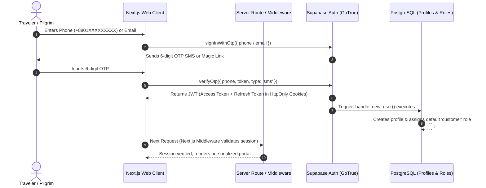

# Shoccho International Travels: Authentication & Row Level Security (RLS) Plan

This document establishes the security architecture, authentication flows, Role-Based Access Control (RBAC), Row Level Security (RLS) policies, and Supabase Storage bucket protections for Shoccho International Travels.

---

## 1. Authentication Architecture

Shoccho serves pilgrims and travelers in Bangladesh and across the diaspora. The authentication flow is designed for extreme simplicity, security, and accessibility.



### Supported Authentication Methods:
1. **SMS Phone OTP (Primary for Bangladesh)**: Using local SMS gateway integration via Supabase Auth (or Twilio/Infobip) supporting `+8801XXXXXXXXX` phone numbers.
2. **Email Magic Link & Password (International Travelers)**: One-click passwordless sign-in for seamless verification.
3. **Google OAuth (Optional Secondary)**: 1-tap social sign-in for desktop convenience.

---

## 2. Role-Based Access Control (RBAC)

### 2.1 The 6 Platform Roles

| Role Name | Scope & Authority |
|:---|:---|
| **Customer** | Regular traveler. Can view public catalog, manage own profile, make bookings, submit inquiries, add family passengers, save wishlists, post reviews, write travel stories, and ask questions. |
| **Muallim** | Verified Islamic scholar/guide. All customer rights + manage Muallim public profile, manage consultation schedule, answer pilgrimage Q&A questions with official badge, and view assigned group pilgrim rosters. |
| **Travel Expert** | Editorial and travel specialist. Can author verified guides, answer customer questions with expert badge, and review community stories. |
| **Partner** | Airline agents, local hotels, or transport contractors. Limited operational access to view assigned booking logistics and manifest sheets. |
| **Admin** | Shoccho operational staff. Full management of packages, departures, bookings, customer CRM, manual offline payment reconciliation, inquiry assignment, review moderation, and report actions. |
| **Super Admin** | Platform executive (Hafez Mawlana Md. Fazle Rabbi / Chairman). Unrestricted access to all data, role assignment, financial audit logs, system configurations, and database triggers. |

### 2.2 Database Helper Functions for RLS

These helper functions run in `SECURITY DEFINER` mode to evaluate permissions efficiently without query recursion:

```sql
-- Check if user has a specific role
CREATE OR REPLACE FUNCTION public.has_role(required_role user_role_type)
RETURNS BOOLEAN AS $$
BEGIN
    RETURN EXISTS (
        SELECT 1 FROM public.user_roles
        WHERE user_id = auth.uid() AND role = required_role
    );
END;
$$ LANGUAGE plpgsql SECURITY DEFINER STABLE;

-- Check if user is an Admin or Super Admin
CREATE OR REPLACE FUNCTION public.is_admin()
RETURNS BOOLEAN AS $$
BEGIN
    RETURN EXISTS (
        SELECT 1 FROM public.user_roles
        WHERE user_id = auth.uid() AND role IN ('admin', 'super_admin')
    );
END;
$$ LANGUAGE plpgsql SECURITY DEFINER STABLE;

-- Check if user is Super Admin
CREATE OR REPLACE FUNCTION public.is_super_admin()
RETURNS BOOLEAN AS $$
BEGIN
    RETURN EXISTS (
        SELECT 1 FROM public.user_roles
        WHERE user_id = auth.uid() AND role = 'super_admin'
    );
END;
$$ LANGUAGE plpgsql SECURITY DEFINER STABLE;
```

---

## 3. Row Level Security (RLS) Strategy

Every table in Shoccho has `ALTER TABLE <name> ENABLE ROW LEVEL SECURITY;` enabled. Policies are divided into two fundamental domains:

### Principle 1: Public Catalog & Knowledge (Read-Heavy)
- Anyone (including unauthenticated anonymous guests) can read published packages, categories, destinations, approved reviews, published travel stories, and answered public questions.
- Only Admins can insert, update, or delete catalog items.

### Principle 2: Customer Identity & Private Data (Write-Protected, Strict Privacy)
- Customer profiles, personal phone numbers, passport scans, booking references, family passenger manifests, private travel journals, and notifications are strictly private.
- Only the owning user (`auth.uid() = user_id`) and authorized staff (`is_admin() = true`) can read or modify these rows.

---

## 4. Comprehensive RLS Policies by Table

### 4.1 `profiles`
```sql
ALTER TABLE profiles ENABLE ROW LEVEL SECURITY;

-- Anyone can view basic public profile info of other members (avatar, name, bio)
CREATE POLICY "Public profiles are readable by everyone"
    ON profiles FOR SELECT
    USING (true);

-- Users can only update their own profile
CREATE POLICY "Users can update own profile"
    ON profiles FOR UPDATE
    USING (auth.uid() = id);

-- Admins can update any profile
CREATE POLICY "Admins can update any profile"
    ON profiles FOR ALL
    USING (is_admin());
```

### 4.2 `user_roles`
```sql
ALTER TABLE user_roles ENABLE ROW LEVEL SECURITY;

-- Users can read their own roles
CREATE POLICY "Users can view own roles"
    ON user_roles FOR SELECT
    USING (auth.uid() = user_id);

-- Only Super Admins can manage roles
CREATE POLICY "Super admins can manage roles"
    ON user_roles FOR ALL
    USING (is_super_admin());
```

### 4.3 `packages`, `destinations`, `package_categories`, `package_departures`
```sql
ALTER TABLE packages ENABLE ROW LEVEL SECURITY;
ALTER TABLE destinations ENABLE ROW LEVEL SECURITY;
ALTER TABLE package_categories ENABLE ROW LEVEL SECURITY;
ALTER TABLE package_departures ENABLE ROW LEVEL SECURITY;

-- Public read for published packages
CREATE POLICY "Public can view published packages"
    ON packages FOR SELECT
    USING (is_published = true OR is_admin());

CREATE POLICY "Public can view destinations"
    ON destinations FOR SELECT
    USING (true);

CREATE POLICY "Public can view categories"
    ON package_categories FOR SELECT
    USING (is_active = true OR is_admin());

CREATE POLICY "Public can view package departures"
    ON package_departures FOR SELECT
    USING (true);

-- Only admins can modify catalog
CREATE POLICY "Admins manage packages"
    ON packages FOR ALL
    USING (is_admin());

CREATE POLICY "Admins manage departures"
    ON package_departures FOR ALL
    USING (is_admin());

CREATE POLICY "Admins manage destinations"
    ON destinations FOR ALL
    USING (is_admin());

CREATE POLICY "Admins manage categories"
    ON package_categories FOR ALL
    USING (is_admin());
```

### 4.4 `bookings` & `booking_passengers` (CRITICAL PRIVACY)
```sql
ALTER TABLE bookings ENABLE ROW LEVEL SECURITY;
ALTER TABLE booking_passengers ENABLE ROW LEVEL SECURITY;

-- Customers can view only their own bookings
CREATE POLICY "Customers can view own bookings"
    ON bookings FOR SELECT
    USING (auth.uid() = user_id OR is_admin());

-- Authenticated users or guests can create a booking
CREATE POLICY "Anyone can create a booking"
    ON bookings FOR INSERT
    WITH CHECK (auth.uid() = user_id OR user_id IS NULL);

-- Only customers can update their own booking if status is 'inquiry' or 'pending'
CREATE POLICY "Customers can modify pending booking notes"
    ON bookings FOR UPDATE
    USING (auth.uid() = user_id AND status IN ('inquiry', 'pending'))
    WITH CHECK (auth.uid() = user_id AND status IN ('inquiry', 'pending'));

-- Admins have full access to manage all bookings
CREATE POLICY "Admins manage all bookings"
    ON bookings FOR ALL
    USING (is_admin());

-- Passenger details privacy:
CREATE POLICY "Users can view passengers of their own bookings"
    ON booking_passengers FOR SELECT
    USING (
        EXISTS (
            SELECT 1 FROM bookings
            WHERE bookings.id = booking_passengers.booking_id
            AND (bookings.user_id = auth.uid() OR is_admin())
        )
    );

CREATE POLICY "Users can insert passengers into own bookings"
    ON booking_passengers FOR INSERT
    WITH CHECK (
        EXISTS (
            SELECT 1 FROM bookings
            WHERE bookings.id = booking_passengers.booking_id
            AND (bookings.user_id = auth.uid() OR is_admin())
        )
    );

CREATE POLICY "Admins manage all passengers"
    ON booking_passengers FOR ALL
    USING (is_admin());
```

### 4.5 `wishlist`
```sql
ALTER TABLE wishlist ENABLE ROW LEVEL SECURITY;

CREATE POLICY "Users view own wishlist"
    ON wishlist FOR SELECT
    USING (auth.uid() = user_id);

CREATE POLICY "Users manage own wishlist"
    ON wishlist FOR ALL
    USING (auth.uid() = user_id);
```

### 4.6 `reviews` & `muallim_reviews`
```sql
ALTER TABLE reviews ENABLE ROW LEVEL SECURITY;
ALTER TABLE muallim_reviews ENABLE ROW LEVEL SECURITY;

-- Anyone can read approved/published reviews
CREATE POLICY "Anyone can view published reviews"
    ON reviews FOR SELECT
    USING (is_published = true OR auth.uid() = user_id OR is_admin());

-- Authenticated users can write a review
CREATE POLICY "Users can create reviews"
    ON reviews FOR INSERT
    WITH CHECK (auth.uid() = user_id);

-- Admins moderate reviews
CREATE POLICY "Admins moderate reviews"
    ON reviews FOR ALL
    USING (is_admin());

-- Muallim Reviews
CREATE POLICY "Anyone can view published muallim reviews"
    ON muallim_reviews FOR SELECT
    USING (is_published = true OR auth.uid() = reviewer_id OR is_admin());

CREATE POLICY "Users can review muallims"
    ON muallim_reviews FOR INSERT
    WITH CHECK (auth.uid() = reviewer_id);
```

### 4.7 `muallim_profiles` & `muallim_verifications`
```sql
ALTER TABLE muallim_profiles ENABLE ROW LEVEL SECURITY;
ALTER TABLE muallim_verifications ENABLE ROW LEVEL SECURITY;

-- Public can view verified muallims
CREATE POLICY "Public can view verified muallims"
    ON muallim_profiles FOR SELECT
    USING (verification_status = 'verified' OR auth.uid() = id OR is_admin());

-- Muallims can edit own bio and details
CREATE POLICY "Muallims can update own profile"
    ON muallim_profiles FOR UPDATE
    USING (auth.uid() = id);

-- Verification documents are strictly private (Muallim owner + Admin)
CREATE POLICY "Muallim can view own verification docs"
    ON muallim_verifications FOR SELECT
    USING (muallim_id = auth.uid() OR is_admin());

CREATE POLICY "Muallim can upload verification docs"
    ON muallim_verifications FOR INSERT
    WITH CHECK (muallim_id = auth.uid());

CREATE POLICY "Admins manage verification docs"
    ON muallim_verifications FOR ALL
    USING (is_admin());
```

### 4.8 `travel_stories`, `posts`, `questions`, `answers`
```sql
ALTER TABLE travel_stories ENABLE ROW LEVEL SECURITY;
ALTER TABLE posts ENABLE ROW LEVEL SECURITY;
ALTER TABLE questions ENABLE ROW LEVEL SECURITY;
ALTER TABLE answers ENABLE ROW LEVEL SECURITY;

-- Public can read approved stories
CREATE POLICY "Public can read published stories"
    ON travel_stories FOR SELECT
    USING (is_published = true OR auth.uid() = author_id OR is_admin());

CREATE POLICY "Authors manage own stories"
    ON travel_stories FOR ALL
    USING (auth.uid() = author_id);

CREATE POLICY "Admins moderate stories"
    ON travel_stories FOR ALL
    USING (is_admin());

-- Questions & Answers
CREATE POLICY "Public read questions"
    ON questions FOR SELECT
    USING (moderation_status = 'approved' OR auth.uid() = user_id OR is_admin());

CREATE POLICY "Users can ask questions"
    ON questions FOR INSERT
    WITH CHECK (auth.uid() = user_id);

CREATE POLICY "Public read answers"
    ON answers FOR SELECT
    USING (true);

CREATE POLICY "Users can answer questions"
    ON answers FOR INSERT
    WITH CHECK (auth.uid() = author_id);
```

---

## 5. Storage Buckets & Policies

Shoccho requires four dedicated Supabase Storage buckets:

| Bucket ID | Access Type | Max File Size | Allowed MIME Types | Purpose |
|:---|:---|:---|:---|:---|
| `public-assets` | Public | 10 MB | JPEG, PNG, WEBP, SVG | Package heroes, destination galleries, marketing banners |
| `user-avatars` | Public | 2 MB | JPEG, PNG, WEBP | Profile avatars for customers and Muallims |
| `travel-media` | Public | 15 MB | JPEG, PNG, WEBP, MP4 | Photos and short videos uploaded in travel stories and community posts |
| `private-documents` | **Private (Encrypted)** | 20 MB | PDF, JPEG, PNG | Passport scans, NID copies, visa certificates, Muallim licenses |

### Storage Security Policies (SQL)

```sql
-- 1. Public Assets
CREATE POLICY "Public Assets are viewable by anyone"
    ON storage.objects FOR SELECT
    USING (bucket_id = 'public-assets');

CREATE POLICY "Admins can upload public assets"
    ON storage.objects FOR INSERT
    WITH CHECK (bucket_id = 'public-assets' AND is_admin());

-- 2. User Avatars
CREATE POLICY "Avatars are viewable by anyone"
    ON storage.objects FOR SELECT
    USING (bucket_id = 'user-avatars');

CREATE POLICY "Users can upload their own avatar"
    ON storage.objects FOR INSERT
    WITH CHECK (
        bucket_id = 'user-avatars' 
        AND auth.uid()::text = (storage.foldername(name))[1]
    );

-- 3. Private Documents (Passports, NIDs) - STRICT
CREATE POLICY "Users can only read their own private documents"
    ON storage.objects FOR SELECT
    USING (
        bucket_id = 'private-documents' 
        AND (
            auth.uid()::text = (storage.foldername(name))[1] 
            OR is_admin()
        )
    );

CREATE POLICY "Users can upload their own private documents"
    ON storage.objects FOR INSERT
    WITH CHECK (
        bucket_id = 'private-documents' 
        AND auth.uid()::text = (storage.foldername(name))[1]
    );
```
