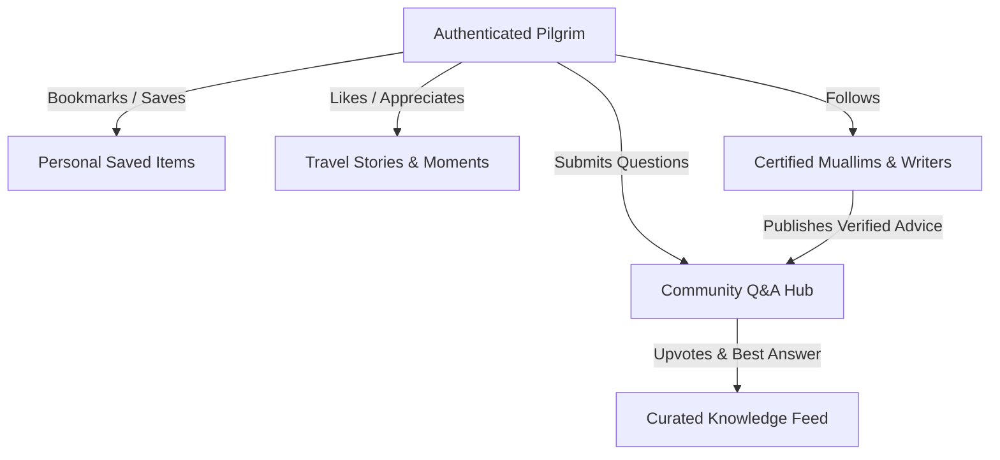

# Shoccho International Travels: Community & Knowledge Future Architecture

This document defines the architecture, content models, engagement mechanics, and moderation strategy for Shoccho's travel community, traveler stories, and Q&A knowledge platform.

---

## 1. Community Design Philosophy: Anti-Social Media

> [!IMPORTANT]
> **Not a Facebook Clone**: Shoccho firmly rejects algorithmic outrage feeds, infinite doom-scrolling, intrusive vanity metrics, and clickbait. The community interface maintains the serenity, luxury, and spiritual dignity of the approved Stitch design identity.

```
┌─────────────────────────────────────────────────────────────────────────┐
│                     THE SHOCCHO COMMUNITY PROMISE                       │
├──────────────────────┬──────────────────────┬───────────────────────────┤
│ 1. Travel & Spirit   │ 2. Verified Wisdom   │ 3. Extreme Cleanliness    │
│ Strict focus on      │ Insights backed by   │ Zero spam, dignified      │
│ pilgrimages, tours,  │ real booking IDs and │ language, and transparent │
│ and practical advice │ certified experts    │ moderation                │
└──────────────────────┴──────────────────────┴───────────────────────────┘
```

---

## 2. Core Content Modules

### 2.1 Magazine Travel Stories (Editorial Long-Form)
- **Concept**: Detailed, inspiring accounts of Hajj, Umrah, and international journeys authored by travelers and guest writers.
- **Structure**:
  - Hero Cover Photograph & Title in Bengali serif (`Noto Serif Bengali`).
  - Journey Overview: Departure date, season, hotel distances from Haram, and total package budget.
  - Day-by-day Itinerary & Spiritual Reflections.
  - High-resolution photo galleries using Supabase Storage CDN.
  - Practical Tips: Nusuk app booking advice, clock tower shortcuts, wheelchair accessibility.
  - Direct Package Tie-in: If the author traveled on a Shoccho package, a discrete banner links directly to the package details.

### 2.2 Live Travel Moments & Ground Advisories
- **Concept**: Real-time practical field notes posted by travelers currently on the ground.
- **Use Cases**:
  - *"আজ মদিনা মুনাওয়ারায় আবহাওয়া খুব মনোরম, মসজিদে নববীতে ভিড় কিছুটা কম।"*
  - *"মক্কার ক্লক টাওয়ার থেকে হারাম শরীফে প্রবেশের ক্ষেত্রে গেট নং ৭৯ দিয়ে প্রবেশ সবচেয়ে সহজ।"*
  - *"জেদ্দা এয়ারপোর্টে নতুন ওমরাহ ভিসা কাউন্টারে বায়োমেট্রিক ৫ মিনিটে সম্পন্ন হচ্ছে।"*
- **Format**: Short updates (under 280 characters) with 1 to 4 photos, geotagged with Makkah, Madinah, Jeddah, Dubai, etc.

### 2.3 Travel Knowledge & Q&A Engine
- **Concept**: Structured question-and-answer exchange addressing practical travel, logistics, and pilgrimage rulings.
- **Features**:
  - Categorized by topic: `#UmrahVisa`, `#FemalePilgrims`, `#IhramRules`, `#ZiyaratGuide`, `#BaggageRules`.
  - Upvoting for clear, accurate answers.
  - **Official Answer Pinning**: Answers provided by certified Muallims or Shoccho Travel Experts receive a prominent green emerald verification border:
    > **✓ স্বচ্ছ ভেরিফাইড মোয়াল্লিম দ্বারা প্রত্যায়িত উত্তর**

### 2.4 Personal Pilgrim Travel Journals
- **Concept**: A private, reflective digital diary for pilgrims to document their spiritual journey day-by-day.
- **Privacy Controls**: Private by default (only visible to the author). Authors may choose to publish specific entries as a public Travel Story upon return.

---

## 3. Engagement & Social Graph



### Purposeful Interactions:
1. **Appreciation (Helpful Counter)**: Rather than generic vanity "likes", posts display a dignified counter: *"২৪ জন এই তথ্যটিকে সহায়ক মনে করেছেন"* (24 people found this helpful).
2. **Saves & Itinerary Bookmarking**: 1-tap save to personal traveler wishlist for easy access when packing or traveling.
3. **Follow Muallims & Experts**: Users receive notifications when followed scholars post journey schedules or live Q&A sessions.

---

## 4. Moderation & Trust Strategy

To safeguard the spiritual and trustworthy atmosphere of the platform:

1. **Pre-Publication Check for New Users**:
   - First-time posters must have their content approved by an admin or travel moderator before appearing on the public feed.
   - Travelers with a completed booking history gain instant-publishing status.
2. **Automated Keyword & Spam Protection**:
   - Instant blocking of commercial ads, unauthorized ticket reseller promotions, political discourse, and offensive terminology.
3. **Community Flagging**:
   - Every post, comment, and story features a discrete "রিপোর্ট করুন" (Report) action with specific reason codes.
   - 3 community flags automatically place the content into the admin moderation queue and hide it pending review.
