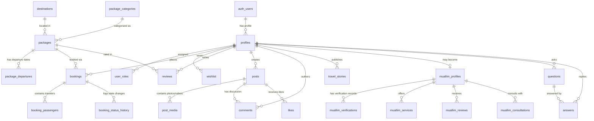

# Shoccho International Travels: Supabase Database Schema

This document defines the complete PostgreSQL schema, tables, custom enums, relationships, indexes, and triggers for Shoccho International Travels on Supabase.

---

## 1. Entity Relationship Diagram (Mermaid)



---

## 2. Enums and Global Types

```sql
-- Core User Roles
CREATE TYPE user_role_type AS ENUM (
    'customer',
    'muallim',
    'travel_expert',
    'partner',
    'admin',
    'super_admin'
);

-- Booking Lifecycle State Machine
CREATE TYPE booking_status_type AS ENUM (
    'inquiry',
    'pending',
    'confirmed',
    'payment_pending',
    'paid',
    'processing',
    'completed',
    'cancelled'
);

-- Muallim Verification Status
CREATE TYPE muallim_verification_status_type AS ENUM (
    'unverified',
    'applied',
    'documents_submitted',
    'interview_scheduled',
    'verified',
    'rejected',
    'suspended'
);

-- Gender Types
CREATE TYPE gender_type AS ENUM ('male', 'female', 'other');

-- Content Moderation Status
CREATE TYPE moderation_status_type AS ENUM ('pending', 'approved', 'flagged', 'rejected');

-- Report Reason Types
CREATE TYPE report_reason_type AS ENUM (
    'spam',
    'inappropriate_content',
    'false_information',
    'harassment',
    'unauthorized_commercial',
    'other'
);
```

---

## 3. Users, Profiles, and Roles

### 3.1 `profiles`
Extends Supabase `auth.users` with travel and customer details.

```sql
CREATE TABLE profiles (
    id UUID PRIMARY KEY REFERENCES auth.users(id) ON DELETE CASCADE,
    full_name_bn TEXT,
    full_name_en TEXT NOT NULL,
    phone TEXT UNIQUE,
    phone_verified BOOLEAN DEFAULT FALSE,
    avatar_url TEXT,
    bio TEXT,
    nationality TEXT DEFAULT 'Bangladeshi',
    passport_number TEXT,
    passport_expiry_date DATE,
    emergency_contact_name TEXT,
    emergency_contact_phone TEXT,
    reward_points INTEGER DEFAULT 0,
    vip_tier TEXT DEFAULT 'Standard',
    created_at TIMESTAMPTZ DEFAULT NOW(),
    updated_at TIMESTAMPTZ DEFAULT NOW()
);

CREATE INDEX idx_profiles_phone ON profiles(phone);
```

### 3.2 `user_roles`
Multi-role association supporting granular permissions.

```sql
CREATE TABLE user_roles (
    id UUID PRIMARY KEY DEFAULT gen_random_uuid(),
    user_id UUID NOT NULL REFERENCES profiles(id) ON DELETE CASCADE,
    role user_role_type NOT NULL DEFAULT 'customer',
    assigned_by UUID REFERENCES profiles(id),
    created_at TIMESTAMPTZ DEFAULT NOW(),
    UNIQUE(user_id, role)
);

CREATE INDEX idx_user_roles_user ON user_roles(user_id);
```

---

## 4. Travel Catalog & Marketplace

### 4.1 `package_categories`
```sql
CREATE TABLE package_categories (
    id UUID PRIMARY KEY DEFAULT gen_random_uuid(),
    slug TEXT UNIQUE NOT NULL,
    title_bn TEXT NOT NULL,
    title_en TEXT NOT NULL,
    description_bn TEXT,
    description_en TEXT,
    icon_name TEXT,
    display_order INTEGER DEFAULT 0,
    is_active BOOLEAN DEFAULT TRUE,
    created_at TIMESTAMPTZ DEFAULT NOW()
);
```

### 4.2 `destinations`
```sql
CREATE TABLE destinations (
    id UUID PRIMARY KEY DEFAULT gen_random_uuid(),
    slug TEXT UNIQUE NOT NULL,
    name_bn TEXT NOT NULL,
    name_en TEXT NOT NULL,
    country_code VARCHAR(3) NOT NULL,
    country_name_bn TEXT NOT NULL,
    country_name_en TEXT NOT NULL,
    region TEXT NOT NULL, -- 'Middle East', 'Asia', 'Europe', 'Domestic'
    overview_bn TEXT,
    overview_en TEXT,
    hero_image_url TEXT,
    gallery_urls TEXT[] DEFAULT '{}',
    is_featured BOOLEAN DEFAULT FALSE,
    created_at TIMESTAMPTZ DEFAULT NOW(),
    updated_at TIMESTAMPTZ DEFAULT NOW()
);

CREATE INDEX idx_destinations_region ON destinations(region);
```

### 4.3 `packages`
Core inventory for Hajj, Umrah, and tours.

```sql
CREATE TABLE packages (
    id UUID PRIMARY KEY DEFAULT gen_random_uuid(),
    slug TEXT UNIQUE NOT NULL,
    category_id UUID REFERENCES package_categories(id) ON DELETE SET NULL,
    destination_id UUID REFERENCES destinations(id) ON DELETE SET NULL,
    title_bn TEXT NOT NULL,
    title_en TEXT NOT NULL,
    subtitle_bn TEXT,
    duration_days INTEGER NOT NULL,
    duration_nights INTEGER NOT NULL,
    base_price NUMERIC(12, 2) NOT NULL,
    currency VARCHAR(5) DEFAULT 'BDT',
    badge_bn TEXT,
    overview_bn TEXT,
    highlights_bn TEXT[] DEFAULT '{}',
    inclusions_bn TEXT[] DEFAULT '{}',
    exclusions_bn TEXT[] DEFAULT '{}',
    hotel_rating_makkah INTEGER,
    hotel_rating_madinah INTEGER,
    hotel_distance_makkah_meters INTEGER,
    hotel_distance_madinah_meters INTEGER,
    hero_image_url TEXT NOT NULL,
    gallery_urls TEXT[] DEFAULT '{}',
    is_featured BOOLEAN DEFAULT FALSE,
    is_published BOOLEAN DEFAULT TRUE,
    view_count INTEGER DEFAULT 0,
    created_at TIMESTAMPTZ DEFAULT NOW(),
    updated_at TIMESTAMPTZ DEFAULT NOW()
);

CREATE INDEX idx_packages_category ON packages(category_id);
CREATE INDEX idx_packages_destination ON packages(destination_id);
CREATE INDEX idx_packages_price ON packages(base_price);
```

### 4.4 `package_departures`
Departure schedules and seat quotas.

```sql
CREATE TABLE package_departures (
    id UUID PRIMARY KEY DEFAULT gen_random_uuid(),
    package_id UUID NOT NULL REFERENCES packages(id) ON DELETE CASCADE,
    departure_date DATE NOT NULL,
    return_date DATE NOT NULL,
    total_capacity INTEGER NOT NULL DEFAULT 40,
    available_seats INTEGER NOT NULL DEFAULT 40,
    price_quad NUMERIC(12, 2) NOT NULL,
    price_triple NUMERIC(12, 2),
    price_double NUMERIC(12, 2),
    airline_name TEXT,
    flight_routing TEXT,
    status TEXT DEFAULT 'booking_open', -- 'booking_open', 'fast_filling', 'sold_out'
    created_at TIMESTAMPTZ DEFAULT NOW()
);

CREATE INDEX idx_package_departures_pkg ON package_departures(package_id);
CREATE INDEX idx_package_departures_date ON package_departures(departure_date);
```

### 4.5 `services` & `visa_services`
```sql
CREATE TABLE services (
    id UUID PRIMARY KEY DEFAULT gen_random_uuid(),
    slug TEXT UNIQUE NOT NULL,
    title_bn TEXT NOT NULL,
    title_en TEXT NOT NULL,
    description_bn TEXT,
    icon_name TEXT,
    is_active BOOLEAN DEFAULT TRUE
);

CREATE TABLE visa_services (
    id UUID PRIMARY KEY DEFAULT gen_random_uuid(),
    country_name_bn TEXT NOT NULL,
    country_name_en TEXT NOT NULL,
    visa_type_bn TEXT NOT NULL,
    processing_time_bn TEXT NOT NULL,
    official_fee NUMERIC(10, 2) NOT NULL,
    service_charge NUMERIC(10, 2) NOT NULL,
    total_fee NUMERIC(10, 2) GENERATED ALWAYS AS (official_fee + service_charge) STORED,
    currency VARCHAR(5) DEFAULT 'BDT',
    requirements_bn TEXT[] DEFAULT '{}',
    is_popular BOOLEAN DEFAULT FALSE,
    created_at TIMESTAMPTZ DEFAULT NOW()
);
```

### 4.6 `flights` & `hotels`
```sql
CREATE TABLE flights (
    id UUID PRIMARY KEY DEFAULT gen_random_uuid(),
    origin_airport VARCHAR(5) NOT NULL, -- DAC
    destination_airport VARCHAR(5) NOT NULL, -- JED, MED, DXB
    airline_name TEXT NOT NULL,
    flight_number TEXT,
    baggage_allowance_kg INTEGER DEFAULT 46,
    typical_fare NUMERIC(10, 2),
    is_direct BOOLEAN DEFAULT TRUE,
    created_at TIMESTAMPTZ DEFAULT NOW()
);

CREATE TABLE hotels (
    id UUID PRIMARY KEY DEFAULT gen_random_uuid(),
    destination_id UUID REFERENCES destinations(id) ON DELETE SET NULL,
    name_bn TEXT NOT NULL,
    name_en TEXT NOT NULL,
    star_rating INTEGER CHECK (star_rating BETWEEN 1 AND 5),
    distance_to_haram_meters INTEGER,
    city TEXT NOT NULL, -- Makkah, Madinah, Dubai, etc.
    photos TEXT[] DEFAULT '{}',
    created_at TIMESTAMPTZ DEFAULT NOW()
);
```

---

## 5. Bookings & Passenger Vault

### 5.1 `bookings`
Main customer reservation records.

```sql
CREATE TABLE bookings (
    id UUID PRIMARY KEY DEFAULT gen_random_uuid(),
    booking_reference VARCHAR(12) UNIQUE NOT NULL, -- e.g. SH-2026-8941
    user_id UUID REFERENCES profiles(id) ON DELETE SET NULL,
    package_id UUID REFERENCES packages(id) ON DELETE SET NULL,
    departure_id UUID REFERENCES package_departures(id) ON DELETE SET NULL,
    custom_title TEXT,
    contact_name TEXT NOT NULL,
    contact_email TEXT NOT NULL,
    contact_phone TEXT NOT NULL,
    total_passengers INTEGER NOT NULL DEFAULT 1,
    room_type TEXT DEFAULT 'quad', -- 'quad', 'triple', 'double', 'single'
    total_amount NUMERIC(12, 2) NOT NULL,
    paid_amount NUMERIC(12, 2) DEFAULT 0,
    currency VARCHAR(5) DEFAULT 'BDT',
    status booking_status_type NOT NULL DEFAULT 'inquiry',
    customer_notes TEXT,
    admin_internal_notes TEXT,
    created_at TIMESTAMPTZ DEFAULT NOW(),
    updated_at TIMESTAMPTZ DEFAULT NOW()
);

CREATE INDEX idx_bookings_user ON bookings(user_id);
CREATE INDEX idx_bookings_ref ON bookings(booking_reference);
CREATE INDEX idx_bookings_status ON bookings(status);
```

### 5.2 `booking_passengers`
Passenger detail records linked to bookings.

```sql
CREATE TABLE booking_passengers (
    id UUID PRIMARY KEY DEFAULT gen_random_uuid(),
    booking_id UUID NOT NULL REFERENCES bookings(id) ON DELETE CASCADE,
    first_name TEXT NOT NULL,
    last_name TEXT NOT NULL,
    gender gender_type NOT NULL,
    date_of_birth DATE NOT NULL,
    passport_number TEXT NOT NULL,
    passport_expiry_date DATE NOT NULL,
    passport_scan_url TEXT,
    photo_url TEXT,
    nid_number TEXT,
    special_requirements TEXT,
    created_at TIMESTAMPTZ DEFAULT NOW()
);

CREATE INDEX idx_passengers_booking ON booking_passengers(booking_id);
```

### 5.3 `booking_status_history`
Audit trail of every state transition.

```sql
CREATE TABLE booking_status_history (
    id UUID PRIMARY KEY DEFAULT gen_random_uuid(),
    booking_id UUID NOT NULL REFERENCES bookings(id) ON DELETE CASCADE,
    previous_status booking_status_type,
    new_status booking_status_type NOT NULL,
    changed_by UUID REFERENCES profiles(id),
    change_reason TEXT,
    created_at TIMESTAMPTZ DEFAULT NOW()
);
```

### 5.4 `wishlist`
```sql
CREATE TABLE wishlist (
    id UUID PRIMARY KEY DEFAULT gen_random_uuid(),
    user_id UUID NOT NULL REFERENCES profiles(id) ON DELETE CASCADE,
    package_id UUID NOT NULL REFERENCES packages(id) ON DELETE CASCADE,
    created_at TIMESTAMPTZ DEFAULT NOW(),
    UNIQUE(user_id, package_id)
);
```

---

## 6. Reviews & Ratings Engine

```sql
CREATE TABLE reviews (
    id UUID PRIMARY KEY DEFAULT gen_random_uuid(),
    user_id UUID NOT NULL REFERENCES profiles(id) ON DELETE CASCADE,
    package_id UUID REFERENCES packages(id) ON DELETE CASCADE,
    booking_id UUID REFERENCES bookings(id) ON DELETE SET NULL,
    rating INTEGER CHECK (rating BETWEEN 1 AND 5) NOT NULL,
    title TEXT,
    content TEXT NOT NULL,
    is_verified_traveler BOOLEAN DEFAULT FALSE,
    is_demo BOOLEAN DEFAULT FALSE,
    is_published BOOLEAN DEFAULT FALSE, -- Requires moderation
    created_at TIMESTAMPTZ DEFAULT NOW()
);

CREATE INDEX idx_reviews_package ON reviews(package_id);
```

---

## 7. Muallim Platform & Spiritual Mentorship

```sql
CREATE TABLE muallim_profiles (
    id UUID PRIMARY KEY REFERENCES profiles(id) ON DELETE CASCADE,
    title_bn TEXT NOT NULL, -- e.g. 'হাফেজ মাওলানা'
    title_en TEXT NOT NULL,
    years_of_experience INTEGER DEFAULT 5,
    hajj_completed_count INTEGER DEFAULT 1,
    umrah_guided_count INTEGER DEFAULT 10,
    languages_spoken TEXT[] DEFAULT '{"Bengali", "Arabic"}',
    specialty_areas TEXT[] DEFAULT '{"Hajj Rituals", "Ziyarat History", "Women Pilgrim Guidance"}',
    islamic_education_background TEXT NOT NULL,
    verification_status muallim_verification_status_type DEFAULT 'applied',
    is_featured BOOLEAN DEFAULT FALSE,
    hourly_consultation_fee NUMERIC(10, 2) DEFAULT 0,
    created_at TIMESTAMPTZ DEFAULT NOW(),
    updated_at TIMESTAMPTZ DEFAULT NOW()
);

CREATE TABLE muallim_verifications (
    id UUID PRIMARY KEY DEFAULT gen_random_uuid(),
    muallim_id UUID NOT NULL REFERENCES muallim_profiles(id) ON DELETE CASCADE,
    document_type TEXT NOT NULL, -- 'National ID', 'Religious Degree', 'Ministry Certificate'
    document_url TEXT NOT NULL,
    verification_notes TEXT,
    reviewed_by UUID REFERENCES profiles(id),
    reviewed_at TIMESTAMPTZ,
    created_at TIMESTAMPTZ DEFAULT NOW()
);

CREATE TABLE muallim_services (
    id UUID PRIMARY KEY DEFAULT gen_random_uuid(),
    muallim_id UUID NOT NULL REFERENCES muallim_profiles(id) ON DELETE CASCADE,
    service_name_bn TEXT NOT NULL,
    service_description_bn TEXT,
    duration_minutes INTEGER DEFAULT 60,
    fee NUMERIC(10, 2) DEFAULT 0,
    is_active BOOLEAN DEFAULT TRUE
);

CREATE TABLE muallim_reviews (
    id UUID PRIMARY KEY DEFAULT gen_random_uuid(),
    muallim_id UUID NOT NULL REFERENCES muallim_profiles(id) ON DELETE CASCADE,
    reviewer_id UUID NOT NULL REFERENCES profiles(id) ON DELETE CASCADE,
    booking_id UUID REFERENCES bookings(id) ON DELETE SET NULL,
    rating INTEGER CHECK (rating BETWEEN 1 AND 5) NOT NULL,
    comment TEXT NOT NULL,
    is_published BOOLEAN DEFAULT FALSE,
    created_at TIMESTAMPTZ DEFAULT NOW()
);

CREATE TABLE muallim_consultations (
    id UUID PRIMARY KEY DEFAULT gen_random_uuid(),
    muallim_id UUID NOT NULL REFERENCES muallim_profiles(id) ON DELETE CASCADE,
    user_id UUID NOT NULL REFERENCES profiles(id) ON DELETE CASCADE,
    scheduled_at TIMESTAMPTZ NOT NULL,
    consultation_type TEXT DEFAULT 'virtual', -- 'virtual', 'in_person_savar'
    status TEXT DEFAULT 'pending', -- 'pending', 'confirmed', 'completed', 'cancelled'
    meeting_link TEXT,
    user_notes TEXT,
    created_at TIMESTAMPTZ DEFAULT NOW()
);
```

---

## 8. Community, UGC & Social Graph

```sql
CREATE TABLE travel_stories (
    id UUID PRIMARY KEY DEFAULT gen_random_uuid(),
    author_id UUID NOT NULL REFERENCES profiles(id) ON DELETE CASCADE,
    title_bn TEXT NOT NULL,
    slug TEXT UNIQUE NOT NULL,
    content_markdown TEXT NOT NULL,
    cover_image_url TEXT,
    destination_id UUID REFERENCES destinations(id) ON DELETE SET NULL,
    read_time_minutes INTEGER DEFAULT 5,
    view_count INTEGER DEFAULT 0,
    moderation_status moderation_status_type DEFAULT 'pending',
    is_published BOOLEAN DEFAULT FALSE,
    published_at TIMESTAMPTZ,
    created_at TIMESTAMPTZ DEFAULT NOW()
);

CREATE TABLE posts (
    id UUID PRIMARY KEY DEFAULT gen_random_uuid(),
    author_id UUID NOT NULL REFERENCES profiles(id) ON DELETE CASCADE,
    destination_id UUID REFERENCES destinations(id) ON DELETE SET NULL,
    content TEXT NOT NULL,
    moderation_status moderation_status_type DEFAULT 'pending',
    is_published BOOLEAN DEFAULT TRUE,
    created_at TIMESTAMPTZ DEFAULT NOW()
);

CREATE TABLE post_media (
    id UUID PRIMARY KEY DEFAULT gen_random_uuid(),
    post_id UUID NOT NULL REFERENCES posts(id) ON DELETE CASCADE,
    media_url TEXT NOT NULL,
    media_type TEXT DEFAULT 'image', -- 'image', 'video'
    display_order INTEGER DEFAULT 0
);

CREATE TABLE comments (
    id UUID PRIMARY KEY DEFAULT gen_random_uuid(),
    post_id UUID REFERENCES posts(id) ON DELETE CASCADE,
    story_id UUID REFERENCES travel_stories(id) ON DELETE CASCADE,
    author_id UUID NOT NULL REFERENCES profiles(id) ON DELETE CASCADE,
    content TEXT NOT NULL,
    moderation_status moderation_status_type DEFAULT 'approved',
    created_at TIMESTAMPTZ DEFAULT NOW()
);

CREATE TABLE likes (
    id UUID PRIMARY KEY DEFAULT gen_random_uuid(),
    user_id UUID NOT NULL REFERENCES profiles(id) ON DELETE CASCADE,
    post_id UUID REFERENCES posts(id) ON DELETE CASCADE,
    story_id UUID REFERENCES travel_stories(id) ON DELETE CASCADE,
    created_at TIMESTAMPTZ DEFAULT NOW()
);

CREATE TABLE saves (
    id UUID PRIMARY KEY DEFAULT gen_random_uuid(),
    user_id UUID NOT NULL REFERENCES profiles(id) ON DELETE CASCADE,
    story_id UUID REFERENCES travel_stories(id) ON DELETE CASCADE,
    created_at TIMESTAMPTZ DEFAULT NOW(),
    UNIQUE(user_id, story_id)
);

CREATE TABLE follows (
    id UUID PRIMARY KEY DEFAULT gen_random_uuid(),
    follower_id UUID NOT NULL REFERENCES profiles(id) ON DELETE CASCADE,
    following_id UUID NOT NULL REFERENCES profiles(id) ON DELETE CASCADE,
    created_at TIMESTAMPTZ DEFAULT NOW(),
    UNIQUE(follower_id, following_id)
);

CREATE TABLE travel_journals (
    id UUID PRIMARY KEY DEFAULT gen_random_uuid(),
    user_id UUID NOT NULL REFERENCES profiles(id) ON DELETE CASCADE,
    booking_id UUID REFERENCES bookings(id) ON DELETE SET NULL,
    day_number INTEGER NOT NULL,
    journal_date DATE NOT NULL,
    location_name TEXT NOT NULL,
    notes TEXT NOT NULL,
    photo_urls TEXT[] DEFAULT '{}',
    is_private BOOLEAN DEFAULT TRUE,
    created_at TIMESTAMPTZ DEFAULT NOW()
);
```

---

## 9. Knowledge & Travel Q&A Engine

```sql
CREATE TABLE questions (
    id UUID PRIMARY KEY DEFAULT gen_random_uuid(),
    user_id UUID NOT NULL REFERENCES profiles(id) ON DELETE CASCADE,
    destination_id UUID REFERENCES destinations(id) ON DELETE SET NULL,
    title TEXT NOT NULL,
    content TEXT NOT NULL,
    tags TEXT[] DEFAULT '{}',
    moderation_status moderation_status_type DEFAULT 'approved',
    is_resolved BOOLEAN DEFAULT FALSE,
    created_at TIMESTAMPTZ DEFAULT NOW()
);

CREATE TABLE answers (
    id UUID PRIMARY KEY DEFAULT gen_random_uuid(),
    question_id UUID NOT NULL REFERENCES questions(id) ON DELETE CASCADE,
    author_id UUID NOT NULL REFERENCES profiles(id) ON DELETE CASCADE,
    content TEXT NOT NULL,
    is_official_expert BOOLEAN DEFAULT FALSE,
    is_accepted BOOLEAN DEFAULT FALSE,
    upvotes_count INTEGER DEFAULT 0,
    created_at TIMESTAMPTZ DEFAULT NOW()
);
```

---

## 10. Platform Operations, Inquiries & Moderation

```sql
CREATE TABLE contact_inquiries (
    id UUID PRIMARY KEY DEFAULT gen_random_uuid(),
    full_name TEXT NOT NULL,
    phone TEXT NOT NULL,
    email TEXT,
    inquiry_type TEXT DEFAULT 'general', -- 'hajj', 'umrah', 'visa', 'flight', 'general'
    message TEXT NOT NULL,
    is_resolved BOOLEAN DEFAULT FALSE,
    assigned_to UUID REFERENCES profiles(id),
    created_at TIMESTAMPTZ DEFAULT NOW()
);

CREATE TABLE notifications (
    id UUID PRIMARY KEY DEFAULT gen_random_uuid(),
    user_id UUID NOT NULL REFERENCES profiles(id) ON DELETE CASCADE,
    title TEXT NOT NULL,
    body TEXT NOT NULL,
    link_url TEXT,
    is_read BOOLEAN DEFAULT FALSE,
    created_at TIMESTAMPTZ DEFAULT NOW()
);

CREATE TABLE reports (
    id UUID PRIMARY KEY DEFAULT gen_random_uuid(),
    reporter_id UUID NOT NULL REFERENCES profiles(id) ON DELETE CASCADE,
    reported_post_id UUID REFERENCES posts(id) ON DELETE CASCADE,
    reported_comment_id UUID REFERENCES comments(id) ON DELETE CASCADE,
    reported_story_id UUID REFERENCES travel_stories(id) ON DELETE CASCADE,
    reason report_reason_type NOT NULL,
    notes TEXT,
    status TEXT DEFAULT 'pending', -- 'pending', 'actioned', 'dismissed'
    actioned_by UUID REFERENCES profiles(id),
    created_at TIMESTAMPTZ DEFAULT NOW()
);
```

---

## 11. Triggers & Automated Functions

### Auto-create Profile on Auth Signup
```sql
CREATE OR REPLACE FUNCTION public.handle_new_user()
RETURNS TRIGGER AS $$
BEGIN
    INSERT INTO public.profiles (id, full_name_en, phone)
    VALUES (
        new.id,
        COALESCE(new.raw_user_meta_data->>'full_name', 'Traveler'),
        new.phone
    );

    INSERT INTO public.user_roles (user_id, role)
    VALUES (new.id, 'customer');

    RETURN new;
END;
$$ LANGUAGE plpgsql SECURITY DEFINER;

CREATE TRIGGER on_auth_user_created
    AFTER INSERT ON auth.users
    FOR EACH ROW EXECUTE PROCEDURE public.handle_new_user();
```

### Auto-log Booking Status Changes
```sql
CREATE OR REPLACE FUNCTION public.log_booking_status_change()
RETURNS TRIGGER AS $$
BEGIN
    IF (OLD.status IS DISTINCT FROM NEW.status) THEN
        INSERT INTO public.booking_status_history (
            booking_id,
            previous_status,
            new_status,
            changed_by
        ) VALUES (
            NEW.id,
            OLD.status,
            NEW.status,
            auth.uid()
        );
    END IF;
    RETURN NEW;
END;
$$ LANGUAGE plpgsql SECURITY DEFINER;

CREATE TRIGGER on_booking_status_updated
    AFTER UPDATE ON public.bookings
    FOR EACH ROW EXECUTE PROCEDURE public.log_booking_status_change();
```
