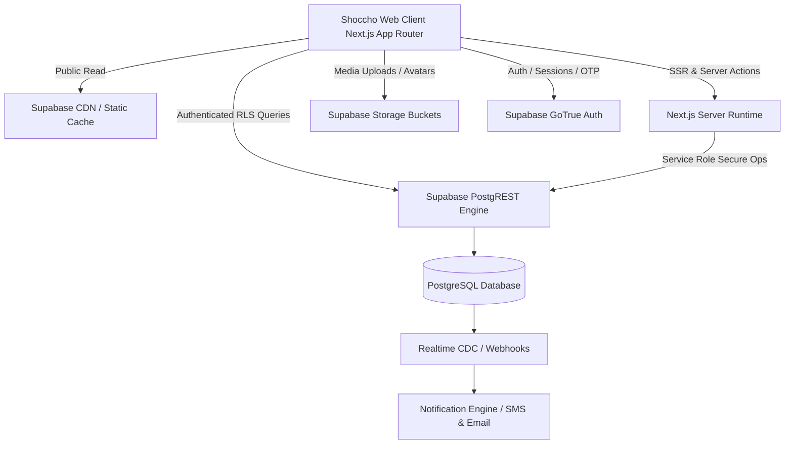

# Shoccho International Travels: Dynamic Platform Architecture

## 1. Executive Summary & Evolution Vision

**Shoccho International Travels (স্বচ্ছ ইন্টারন্যাশনাল ট্রাভেলস)** is evolving from a Phase 1 static luxury showcase into a comprehensive, dynamic travel ecosystem. The platform serves Bangladeshi and international travelers with a focus on trust, spiritual excellence, and transparency.

```
┌──────────────────────────────────────────────────────────────────────────┐
│                   SHOCCHO DYNAMIC TRAVEL PLATFORM                        │
├──────────────┬──────────────┬──────────────┬──────────────┬──────────────┤
│ 1. Travel    │ 2. Booking   │ 3. Customer  │ 4. Travel    │ 5. Muallim   │ 6. Travel   │
│ Marketplace  │ & Operations │ Portal       │ Community    │ Discovery    │ Q&A Engine  │
│ & Catalog    │ Lifecycle    │ & Loyalty    │ & Stories    │ & Mentorship │ & Knowledge │
└──────────────┴──────────────┴──────────────┴──────────────┴──────────────┴─────────────┘
```

### Core Evolution Principles:
1. **Preserve Stitch Visual Identity**: The approved Google Stitch luxury design system—featuring deep imperial emerald (`#00453d`), warm champagne gold (`#735c00`), serene canvas (`#f2fcf6`), and classical Bengali typography (`Noto Serif Bengali` & `Hind Siliguri`)—remains the single visual source of truth.
2. **Strict Separation of Concerns**: Public catalog content is separated from private customer booking, payment, and identity records.
3. **Progressive Enhancement**: The frontend gracefully falls back to static seed data if backend services are offline, guaranteeing zero visual degradation during migration.
4. **Purpose-Built Travel Community**: We reject generic social media bloat. The community features focus on pilgrimage tips, ziyarat updates, and verified traveler wisdom.

---

## 2. Existing Codebase Analysis

### What Remains Unchanged (UI & Design System)
- **Visual Design Tokens**: Exact hex color codes, typography scales, border radii, shadows, and spacing rules in `globals.css`.
- **Editorial Brand Assets**: Vector crescent & compass SVG logo (`/public/images/logo.svg`), high-res photography, and curated branding copy.
- **Component Layout Hierarchy**: The 12 Stitch sections on the homepage:
  - Top Utility Bar & Navigation (`Navbar.tsx`)
  - Luxury Editorial Hero (`HeroSection.tsx`)
  - Smart Progressive Travel Search (`SmartTravelSearch.tsx`)
  - Quick Service Action Cards (`QuickServiceActions.tsx`)
  - Personalized Member Discovery (`PersonalizedDiscovery.tsx`)
  - Hajj & Umrah 5-Step Roadmap (`HajjUmrahFeature.tsx`)
  - Magazine Editorial Featured Journeys (`FeaturedPackages.tsx`)
  - Destination Matrix Mosaic (`DestinationDiscovery.tsx`)
  - Visa Concierge & Air Ticketing Desk (`ServicesSection.tsx`)
  - Trust Architecture & Founder Story (`TrustSection.tsx`)
  - Customer Testimonials (`TestimonialsSection.tsx`)
  - Footer & Mobile Sticky Bottom Bar (`Footer.tsx`, `MobileStickyBar.tsx`)

### What Becomes Dynamic

| Existing Static Element | Dynamic Evolution | Backend Source |
|:---|:---|:---|
| Static `packages.ts` array | Dynamic package catalog with live seat availability, seasonal pricing, departure batches, and filter indexing | `packages`, `package_departures`, `package_categories` |
| Static `destinations.ts` | Searchable destination catalog with active visa alerts and weather/ziyarat advisories | `destinations` |
| Static `visaData` object | Real-time visa requirement engine with dynamic embassy fees, document checklists, and submission status | `visa_services` |
| Hardcoded VIP user chip (`তানভীর আহমেদ`) | Dynamic authenticated session state, profile avatar, reward tier, and wishlist count | `profiles`, `user_roles` via Supabase Auth |
| Static `QuickInquiryModal` form | End-to-end booking & inquiry pipeline with instant reference number generation and SMS/email alerts | `bookings`, `booking_passengers`, `contact_inquiries` |
| Hardcoded Demo Testimonials | Authenticated reviews with verified traveler badges, star breakdowns, and moderation status | `reviews` |
| Static articles in `travelStories.ts` | Full CMS with user-generated travel journals, pilgrim experiences, and Q&A exchanges | `travel_stories`, `questions`, `answers` |

---

## 3. Platform Pillars Architecture



### Pillar 1: Travel Marketplace & Dynamic Catalog
- Hierarchical categories: Primary (Hajj, Umrah, International Leisure, Domestic Tours, Visa Services, Flights, Hotels).
- Seasonal departure batches with dynamic seat limits, early-bird rates, and tiered room configurations (Quad, Triple, Double, VIP Suite).
- Real-time search index utilizing PostgreSQL full-text search (`tsvector`) supporting Bengali and English keywords.

### Pillar 2: Booking Engine & Lifecycle State Machine
Every booking follows a strictly audited, append-only status lifecycle:

```
[1. Inquiry] 
     │
     ▼
[2. Pending] ──(Admin Review / Availability Check)──> [Cancelled]
     │
     ▼
[3. Confirmed] 
     │
     ▼
[4. Payment Pending] ──(Offline Bank/Cash or Gateway)──> [Cancelled]
     │
     ▼
[5. Paid] 
     │
     ▼
[6. Processing] (Visa submission, Flight ticketing, Hotel vouchers issued)
     │
     ▼
[7. Completed] (Journey concluded, Review invitation triggered)
```

### Pillar 3: Customer Account Platform & Passenger Vault
- Traveler Profiles: Family member directory for 1-click booking reuse (saved passport details, birthdates, national ID numbers, and emergency contacts).
- Document Vault: Encrypted personal document storage (passports, vaccination certificates, photos) with strict RLS ensuring access only to the profile owner and assigned agents.
- Interactive Dashboard: Real-time journey timeline, flight PNR tracker, hotel voucher download, and live representative contact.

### Pillar 4: Travel Community & Pilgrim Stories
- Authentic Travel Stories: Long-form verified pilgrim and traveler journals with photo galleries, hotel feedback, and day-by-day itineraries.
- Social Engagement: Bookmarking/saving packages to wishlists, following expert travelers, and helpfulness upvoting.
- Content Moderation: Automated word filtering, community report queues, and admin editorial review prior to public indexing.

### Pillar 5: Muallim Discovery & Mentorship Platform
- Certified Islamic scholar and Muallim directory with credentials, verified Hajj/Umrah guiding experience, languages spoken, and service specialties.
- Direct consultation booking for pre-pilgrimage preparation and spiritual guidance.
- Pilgrim-to-Muallim review loop ensuring high accountability and service excellence.

### Pillar 6: Travel Knowledge & Q&A Platform
- Community Q&A hub for practical travel inquiries: Umrah visa nuances, transit guidelines, baggage restrictions, female traveler guidelines, and recommended ziyarat spots.
- Verified answers from certified Muallims and Shoccho travel experts with official badge pinning.

---

## 4. Technical Architecture: Next.js App Router + Supabase

### Runtime Architecture
```
src/
├── app/
│   ├── (auth)/                # Login, Register, Forgot Password, Verify OTP
│   ├── (customer)/            # Customer Dashboard, Bookings, Passports, Wishlist
│   ├── (public)/              # Homepage, Packages, Destinations, Visa, Muallims, Q&A
│   ├── (community)/           # Travel Stories, Community Feed, Post Details
│   ├── (admin)/               # Secure Back-Office Management Console
│   ├── api/                   # Webhook endpoints (SMS gateway, payments, notifications)
│   └── layout.tsx             # Root layout with fonts, branding, and global providers
├── lib/
│   ├── supabase/
│   │   ├── client.ts          # Client-side Supabase client (browser anon key)
│   │   ├── server.ts          # Server-side Supabase client (cookies / SSR)
│   │   ├── admin.ts           # Elevated Service Role client (strictly server-side)
│   │   └── middleware.ts      # Auth session refresh & route protection
│   └── utils/                 # Formatting, currency, date helpers
├── services/                  # Business logic services (Packages, Bookings, Muallims)
└── types/                     # Database-generated TypeScript types
```

### State & Caching Strategy
- **Static Pages with ISR**: Marketing pages (Homepage, About, General Visa Rules) are cached and revalidated using `revalidatePath()` on content updates.
- **Dynamic Server Rendering**: Search results, departure availability, and customer dashboard pages are rendered server-side with fresh data.
- **Client Transitions**: Optimistic UI updates for likes, saves, and filter selections.

---

## 5. Phased Migration Strategy (Demo Data to Supabase)

To maintain platform stability and zero downtime, migration is split into four distinct stages:

```
┌─────────────────┐     ┌──────────────────┐     ┌──────────────────┐     ┌─────────────────┐
│ Stage 1: Schema │ ──> │ Stage 2: Data    │ ──> │ Stage 3: Adapter  │ ──> │ Stage 4: Native │
│ Deployment & RLS│     │ Seeding Script   │     │ Hybrid Layer     │     │ Dynamic Cutover │
└─────────────────┘     └──────────────────┘     └──────────────────┘     └─────────────────┘
```

1. **Stage 1 (Schema Deployment)**: Run the consolidated SQL DDL in Supabase to provision all 26+ tables, custom ENUMs, triggers, and RLS policies.
2. **Stage 2 (Data Seeding)**: Execute automated Node.js seed script converting `src/data/*.ts` into relational PostgreSQL rows:
   - `packages.ts` ➔ `packages`, `package_categories`, `package_departures`
   - `destinations.ts` ➔ `destinations`
   - `travelStories.ts` ➔ `travel_stories`
   - `services.ts` ➔ `services`, `visa_services`
3. **Stage 3 (Hybrid Adapter Layer)**: Introduce a repository pattern (`packagesService.ts`, etc.) that queries Supabase when connected, falling back seamlessly to static data if environment keys are unset.
4. **Stage 4 (Native Cutover)**: Connect authentication, live booking creation, and dynamic user accounts without breaking any visual elements of the Stitch design.
