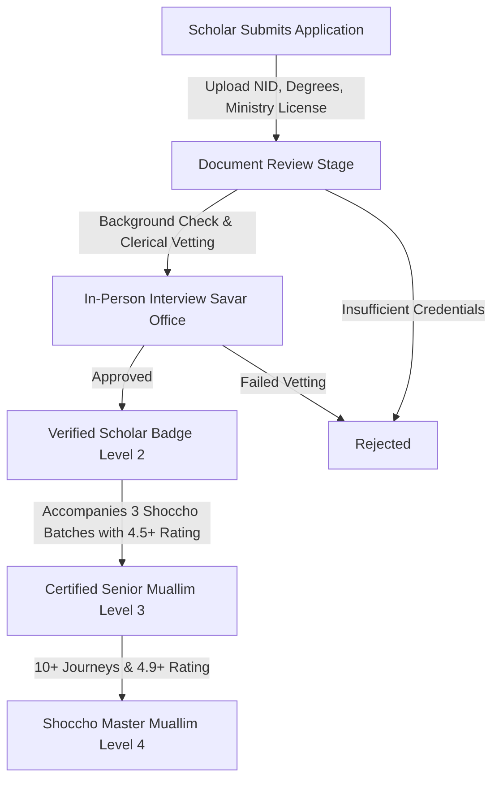

# Shoccho International Travels: Muallim Discovery & Mentorship Future Architecture

This document defines the architecture, accreditation workflows, service models, and review accountability loop for the **Muallim Discovery & Religious Mentorship Platform**.

---

## 1. The Core Role of the Muallim in Pilgrimage

For millions of Bangladeshi pilgrims, the **Muallim (মোয়াল্লিম / গাইড)** is the spiritual heartbeat of Hajj and Umrah. A knowledgeable, patient, and compassionate Muallim transforms a pilgrimage from an anxious logistical ordeal into an unforgettable, spiritually uplifting journey.

```
┌─────────────────────────────────────────────────────────────────────────┐
│                      THE MUALLIM VALUE PROMISE                          │
├──────────────────────┬──────────────────────┬───────────────────────────┤
│ 1. Flawless Rituals  │ 2. Ground Serenity   │ 3. Deep Historical Wisdom │
│ Step-by-step guidance│ Calming presence     │ Enriching Ziyarat tours   │
│ on Ihram, Tawaf,     │ during crowded Mina, │ with authentic Sirah and  │
│ Sa'i, and Halq       │ Arafat, & Rawdah     │ Islamic history           │
└──────────────────────┴──────────────────────┴───────────────────────────┘
```

Shoccho eliminates the traditional industry opacity where pilgrims book without knowing who will guide them. We provide **100% transparency in Muallim selection, credentials, and track records**.

---

## 2. Multi-Tiered Verification Framework

Every scholar on Shoccho must pass through a strict, multi-stage vetting process managed through the Admin console:



### Verification Tiers:
1. **Tier 1: Registered Applicant** (`applied`): Account created, awaiting verification. Profile hidden from public directory.
2. **Tier 2: Background Verified** (`verified`): Government NID, Islamic educational credentials (e.g. Dawrah-e-Hadith, Kamil, Islamic University degree), and references verified. Public profile enabled with standard verified badge.
3. **Tier 3: Ministry Certified**: Holds official certification from the Ministry of Religious Affairs (Bangladesh / Saudi MoHU).
4. **Tier 4: Shoccho Master Muallim**: Experienced scholar who has led more than 10 groups with Shoccho International Travels, maintaining an aggregate rating higher than 4.8/5.0.

---

## 3. Muallim Profile Anatomy

The public Muallim profile is rendered within the Stitch visual design system:

```
┌─────────────────────────────────────────────────────────────────────────┐
│ [Photo with Gold Ring]   হাফেজ মাওলানা মোঃ ফজল রাব্বি               │
│                          প্রধান মোয়াল্লিম ও ট্রাভেল মেন্টর              │
│                          ★★★★★ 4.98 (১২৪ যাচাইকৃত রিভিউ)               │
├─────────────────────────────────────────────────────────────────────────┤
│ • শিক্ষাগত পটভূমি: জামিয়া শারইয়্যাহ মালিবাগ, দাওরায়ে হাদিস             │
│ • অভিজ্ঞতা: ১২+ বছর | হজ সম্পন্ন: ৯ বার | ওমরাহ পরিচালনা: ৪৫+ বার        │
│ • ভাষা: বাংলা, আরবি, উর্দু, ইংরেজি                                       │
│ • বিশেষত্ব: হজের মাসায়েল, ঐতিহাসিক জিয়ারত নির্দেশনা, প্রবীণদের যত্ন    │
├─────────────────────────────────────────────────────────────────────────┤
│ [আসন্ন কাফেলা সমূহ]                                                     │
│ ➔ ১৫ রমজান ভিআইপি ওমরাহ কাফেলা (বুকিং ওপেন)                             │
│ ➔ আসন্ন হজ্জ ২০২৬ প্রিমিয়াম গ্রুপ (সীমিত সিট)                           │
├─────────────────────────────────────────────────────────────────────────┤
│ [১-অন-১ কনসালটেশন বুক করুন]   [প্রশ্ন করুন]   [প্রোফাইল বুকমার্ক করুন] │
└─────────────────────────────────────────────────────────────────────────┘
```

---

## 4. Service Offerings & Pilgrimage Integration

### 4.1 Group Pilgrimage Guiding
- Every Shoccho Hajj and Umrah package prominently displays its assigned Chief Muallim on the package details page.
- Pilgrims can review their Muallim's video introduction, biography, and past pilgrim reviews before making a deposit.

### 4.2 1-on-1 Pre-Departure Spiritual Consultation
- Pilgrims preparing for their first pilgrimage can schedule a 45-minute virtual video call or an in-person meeting at the Joytun Plaza, Savar office.
- Topics: Ihram rules for women, medical exemptions, specific du'a guidelines, and step-by-step mental preparation.

### 4.3 Ground Ziyarat & Lecture Series
- Daily spiritual Halaqah (আলোচনা সভা) held in the hotel lobby in Makkah and Madinah.
- Historical narrations at Mount Uhud, Jabal al-Nur, and Masjid Quba explaining the prophetic context.

---

## 5. Verified Pilgrim Review & Accountability Loop

To eliminate fake testimonials and guarantee total honesty (in accordance with Shoccho's brand name "স্বচ্ছ"):

1. **Booking Verification Enforced**: Only customers with a `completed` booking associated with a specific departure batch and Muallim can submit a rating.
2. **Four-Dimensional Rating Scale**:
   - **মাসায়েল ও ইলমি দক্ষতা** (Islamic Knowledge & Accuracy): Depth of knowledge in Hajj/Umrah fiqh.
   - **ধৈর্য ও অমায়িকতা** (Patience & Demeanor): Calmness and empathy during crowds and delays.
   - **যোগাযোগ ও সার্বক্ষণিক সহায়তা** (Communication & Availability): Accessibility when pilgrims needed on-ground assistance.
   - **জিয়ারত উপস্থাপনা** (Ziyarat Narration): Quality and depth of historical storytelling.
3. **Public Pilgrim Testimonials**: Reviews are displayed transparently with the pilgrim's departure year and badge (e.g. `হজ্জ ২০২৫ কাফেলা যাত্রী`).
